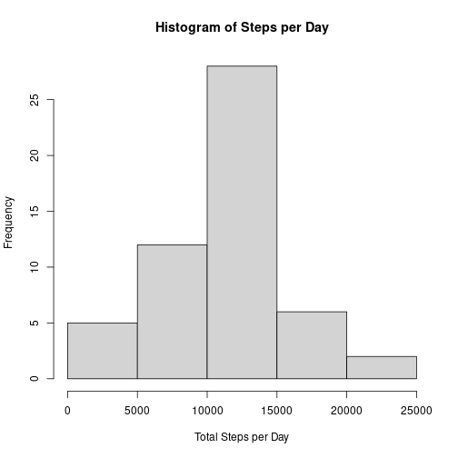
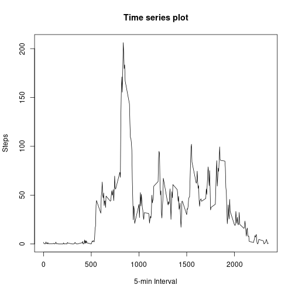
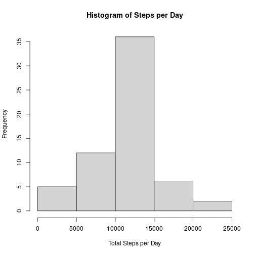
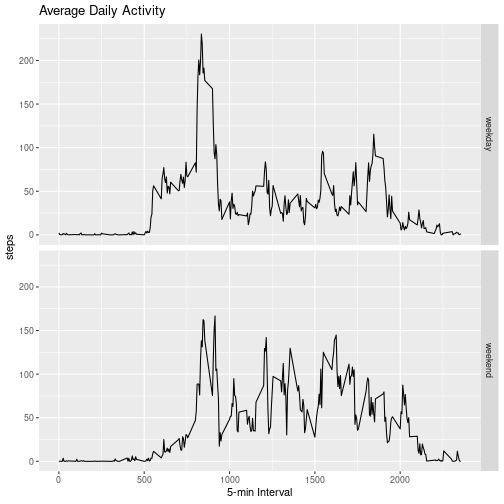

## Reproducible Research: Peer Assessment 1

This is an R Markdown document to read activity monitoring data and run some analysis.

## Loading and preprocessing the data

Let's download the zip file and unzip it.


```r
fileURL<-"https://d396qusza40orc.cloudfront.net/repdata%2Fdata%2Factivity.zip"
download.file(fileURL,"data.zip")
unzip(zipfile="data.zip",exdir="./TestR_Data")
```
Set the directory where the file was unzip and verify the presence of the file

```r
setwd("./TestR_Data/")
dir()
```
Read the CSV file and identify the na elements

```r
read.csv("activity.csv",na=NA)->data
```
## What is mean total number of steps taken per day?
Remove na to create a available data to be analyzed

```r
data[which(!is.na(data$steps)),]->dataAvail
```
Calculating the total number of steps per day

```r
aggregate(steps~date,dataAvail,sum)->totalStepsPerDay
totalStepsPerDay
```

```
##          date steps
## 1  2012-10-02   126
## 2  2012-10-03 11352
## 3  2012-10-04 12116
## 4  2012-10-05 13294
## 5  2012-10-06 15420
## 6  2012-10-07 11015
## 7  2012-10-09 12811
## 8  2012-10-10  9900
## 9  2012-10-11 10304
## 10 2012-10-12 17382
## 11 2012-10-13 12426
## 12 2012-10-14 15098
## 13 2012-10-15 10139
## 14 2012-10-16 15084
## 15 2012-10-17 13452
## 16 2012-10-18 10056
## 17 2012-10-19 11829
## 18 2012-10-20 10395
## 19 2012-10-21  8821
## 20 2012-10-22 13460
## 21 2012-10-23  8918
## 22 2012-10-24  8355
## 23 2012-10-25  2492
## 24 2012-10-26  6778
## 25 2012-10-27 10119
## 26 2012-10-28 11458
## 27 2012-10-29  5018
## 28 2012-10-30  9819
## 29 2012-10-31 15414
## 30 2012-11-02 10600
## 31 2012-11-03 10571
## 32 2012-11-05 10439
## 33 2012-11-06  8334
## 34 2012-11-07 12883
## 35 2012-11-08  3219
## 36 2012-11-11 12608
## 37 2012-11-12 10765
## 38 2012-11-13  7336
## 39 2012-11-15    41
## 40 2012-11-16  5441
## 41 2012-11-17 14339
## 42 2012-11-18 15110
## 43 2012-11-19  8841
## 44 2012-11-20  4472
## 45 2012-11-21 12787
## 46 2012-11-22 20427
## 47 2012-11-23 21194
## 48 2012-11-24 14478
## 49 2012-11-25 11834
## 50 2012-11-26 11162
## 51 2012-11-27 13646
## 52 2012-11-28 10183
## 53 2012-11-29  7047
```
Make a histogram of the total number of steps taken each day

```r
hist(totalStepsPerDay$steps, xlab="Total Steps per Day", main="Histogram of Steps per Day")
```



Calculate and report the mean and median of the total number of steps taken per day
1. for Mean

```r
mean(totalStepsPerDay$steps)
```

```
## [1] 10766.19
```
2. for Median

```r
median(totalStepsPerDay$steps)
```

```
## [1] 10765
```
## What is the average daily activity pattern?
Aggregate steps information by interval, calculating a mean for each one.

```r
aggregate(steps~interval,data,mean)->meanInterval
```
Making a time series plot

```r
plot(meanInterval,type="l",xlab="5-min Interval",ylab="Steps",main="Time series plot")
```



Which 5-min interval, contains the maximum number of steps?

```r
meanInterval[which(meanInterval$steps==max(meanInterval$steps)),]
```

```
##     interval    steps
## 104      835 206.1698
```

## Imputing missing values

Calculating and report the total number of missing values

```r
is.na(data)->missed
nrow(missed[which(missed=="TRUE"),])
```

```
## [1] 2304
```
Filling all of the missing values in the dataset. 
Let's use mean values for each interval.

```r
transform(data,steps=ifelse(is.na(data$steps),meanInterval$steps[match(data$interval,meanInterval$interval)],data$steps))->impData
```
```impData``` represents the new dataset with missing data filled in.

Make a histogram of the total number of steps taken each day with this new dataset

1. Calculating the total number of steps per day

```r
aggregate(steps~date,impData,sum)->totalStepsImp
totalStepsImp
```

```
##          date    steps
## 1  2012-10-01 10766.19
## 2  2012-10-02   126.00
## 3  2012-10-03 11352.00
## 4  2012-10-04 12116.00
## 5  2012-10-05 13294.00
## 6  2012-10-06 15420.00
## 7  2012-10-07 11015.00
## 8  2012-10-08 10766.19
## 9  2012-10-09 12811.00
## 10 2012-10-10  9900.00
## 11 2012-10-11 10304.00
## 12 2012-10-12 17382.00
## 13 2012-10-13 12426.00
## 14 2012-10-14 15098.00
## 15 2012-10-15 10139.00
## 16 2012-10-16 15084.00
## 17 2012-10-17 13452.00
## 18 2012-10-18 10056.00
## 19 2012-10-19 11829.00
## 20 2012-10-20 10395.00
## 21 2012-10-21  8821.00
## 22 2012-10-22 13460.00
## 23 2012-10-23  8918.00
## 24 2012-10-24  8355.00
## 25 2012-10-25  2492.00
## 26 2012-10-26  6778.00
## 27 2012-10-27 10119.00
## 28 2012-10-28 11458.00
## 29 2012-10-29  5018.00
## 30 2012-10-30  9819.00
## 31 2012-10-31 15414.00
## 32 2012-11-01 10766.19
## 33 2012-11-02 10600.00
## 34 2012-11-03 10571.00
## 35 2012-11-04 10766.19
## 36 2012-11-05 10439.00
## 37 2012-11-06  8334.00
## 38 2012-11-07 12883.00
## 39 2012-11-08  3219.00
## 40 2012-11-09 10766.19
## 41 2012-11-10 10766.19
## 42 2012-11-11 12608.00
## 43 2012-11-12 10765.00
## 44 2012-11-13  7336.00
## 45 2012-11-14 10766.19
## 46 2012-11-15    41.00
## 47 2012-11-16  5441.00
## 48 2012-11-17 14339.00
## 49 2012-11-18 15110.00
## 50 2012-11-19  8841.00
## 51 2012-11-20  4472.00
## 52 2012-11-21 12787.00
## 53 2012-11-22 20427.00
## 54 2012-11-23 21194.00
## 55 2012-11-24 14478.00
## 56 2012-11-25 11834.00
## 57 2012-11-26 11162.00
## 58 2012-11-27 13646.00
## 59 2012-11-28 10183.00
## 60 2012-11-29  7047.00
## 61 2012-11-30 10766.19
```
2. Making the histogram

```r
hist(totalStepsImp$steps, xlab="Total Steps per Day", main="Histogram of Steps per Day")
```



3. Calculate and report the mean and median of the total number of steps taken per day
3.1. for Mean

```r
mean(totalStepsImp$steps)
```

```
## [1] 10766.19
```
3.2. for Median

```r
median(totalStepsImp$steps)
```

```
## [1] 10766.19
```
## Are there differences in activity patterns between weekdays and weekends?
Creating a new factor variable indicating if the date is weekend or weekday

```r
#Converting date information in date class
as.Date(impData$date)->impData$date
#applying weekdays function
sapply(impData$date,weekdays)->impData$day
#transforming data
transform(impData,day=ifelse(impData$day=="sábado","weekend",ifelse(impData$day=="domingo","weekend","weekday")))->impDataDay
```
Make a panel plot containing a time series plot

```r
#create a frame with mean data for day and intervals
meanStepsByDay <- aggregate(steps ~ interval + day, impDataDay, mean)
#plotting the graph
library(ggplot2)
ggplot(meanStepsByDay,aes(interval,steps))->g
g+geom_line()+facet_grid(day~.)+ggtitle("Average Daily Activity")+xlab("5-min Interval")
```



